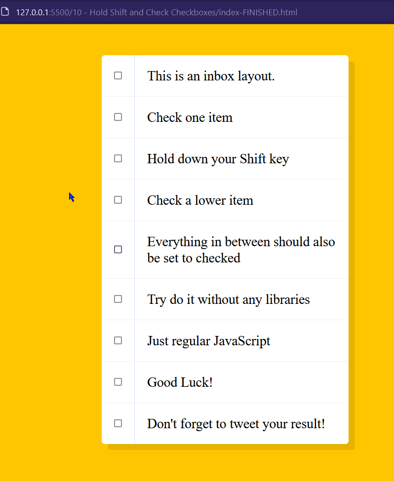

# Notes

## Bug found!

If a user uses the `Shift` key while selecting the first element, Wes' function checks all the boxes until the end of the list.

+1 to my [long, cumbersome solution](../ProjectFiles-Adrian/10%20-%20Hold%20Shift%20and%20check%20checkboxes/index.html). :smile:

## Adjacent sibling combinator
In order to style the checked elements he uses the adjacent sibling combinator
as elements `<input>` and `<p>` are direct siblings:
```css
    input:checked + p {
      background: #F9F9F9;
      text-decoration: line-through;
    }
```
- "[Adjacent sibling combinator](https://developer.mozilla.org/en-US/docs/Web/CSS/Adjacent_sibling_combinator)" - _MDN_


### Resources

- "[\<input\>.checked attribute](https://developer.mozilla.org/en-US/docs/Web/HTML/Element/input#checked)" - _MDN_
- "[MouseEvent.shiftKey](https://developer.mozilla.org/en-US/docs/Web/API/MouseEvent/shiftKey)" - _MDN_


